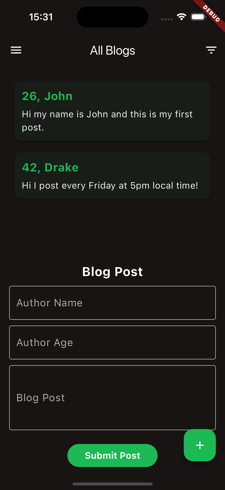

# SQFlite in Flutter: Open Source Learning Series

Welcome to **SQFlite in Flutter**, part of my open-source series to help developers learn the fundamentals of working with SQL databases in Flutter. This project covers essential concepts such as creating and interacting with an SQLite database, dynamically changing themes (light and dark mode), and building a blog manager using Flutter.

## Features

- **CRUD Operations**: You can create, read, update, and delete blog posts, with all data being persisted locally using SQLite.
- **Dynamic Theme Switching**: Users can toggle between light and dark modes.
- **Animations**: Smooth transitions for form visibility using Flutter animations.
- **Responsive Design**: Scalable and adaptable layout for mobile platforms.

---
## Screenshots

<p float="left">
  
  
</p>

## Screenshots

### Dark Mode


### Light Mode


## Getting Started

### Prerequisites

To get started with this project, you need to have the following installed:

- Flutter SDK: [Install Flutter](https://flutter.dev/docs/get-started/install)
- A code editor like **VS Code** or **Android Studio**
- A simulator/emulator or a physical device for running the application

### Project Setup

1. **Clone the repository:**

   ```bash
   git clone https://github.com/Felixburton7/SQFlite-in-Flutter-Open-Source-Series.git
   cd SQFlite-in-Flutter-Open-Source-Series
   ```

2. **Install dependencies:**

   Navigate to the project directory and install all dependencies.

   ```bash
   flutter pub get
   ```

3. **Run the application:**

   Run the project using:

   ```bash
   flutter run
   ```

   This will launch the app on your connected device or simulator.

---

## Project Structure

- `lib/main.dart`: This is the main entry point of the app. It handles theme management (dark and light modes) and launches the home page.
- `lib/data/datasources/datasource.dart`: This file defines the **Datasource** class that manages SQLite database interactions. It includes methods for inserting, updating, deleting, and retrieving blog posts.
- `lib/data/models/blog_model.dart`: This file defines the **Blog** model that represents each blog post with properties like `name`, `age`, and `post`.
- `lib/presentation/pages/homepage.dart`: The homepage widget contains the UI logic for displaying the list of blogs, the form for adding/editing blogs, and the drawer for additional options like theme switching.
- `lib/core/theme_extensions.dart`: This file contains the light and dark theme configurations used throughout the app.
- `lib/presentation/widgets/blog_card.dart`: A reusable widget for displaying individual blog posts in the form of cards.

---

## Core Concepts

### 1. **SQLite Database Integration (SQFlite)**

This project uses the `sqflite` package to manage SQLite databases. You will learn how to:

- **Create a table** for storing blog data.
- **Insert, update, and delete records** from an SQLite database.
- **Query the database** to retrieve blog posts.

Example of inserting a blog post:
```dart
await db.insert(
  'blogs',
  blog.toMap(),
  conflictAlgorithm: ConflictAlgorithm.replace,
);
```

### 2. **Dynamic Theme Switching (Light/Dark Mode)**

This project implements theme switching, allowing the user to toggle between **light mode** and **dark mode**. It leverages the `ThemeMode` parameter of the `MaterialApp` widget and passes the current theme state down to the rest of the app.

Example of how the theme is switched:
```dart
setState(() {
  _themeMode = isDarkMode ? ThemeMode.dark : ThemeMode.light;
});
```

### 3. **Animations**

The app uses smooth animations to show/hide the form for adding/editing blog posts. The `AnimationController` and `Tween` widgets are used to control the opacity and visibility of the form.

Example of using animation:
```dart
_textFieldOpacity = Tween<double>(begin: 0, end: 1).animate(_animationController);
```

---

## How to Contribute

Feel free to contribute to this project by following these steps:

1. Fork the repository
2. Create a new feature branch (`git checkout -b feature/your-feature`)
3. Commit your changes (`git commit -m 'Add some feature'`)
4. Push to the branch (`git push origin feature/your-feature`)
5. Create a new Pull Request

---

## License

This project is licensed under the MIT License - see the [LICENSE](LICENSE) file for details.

---

## Resources

- [Flutter Documentation](https://flutter.dev/docs)
- [SQFlite Documentation](https://pub.dev/packages/sqflite)
- [SQLite Official Site](https://www.sqlite.org/index.html)

---

By following this tutorial, you will gain practical experience in building and managing local databases in Flutter, which is essential for apps that need offline functionality or persistent storage.

If you find this project useful or have suggestions, feel free to raise an issue or submit a pull request! Happy coding!

---

Let me know if you'd like any further modifications!
